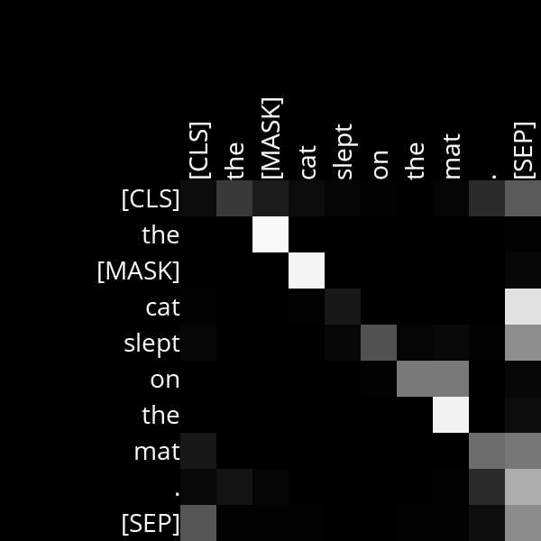
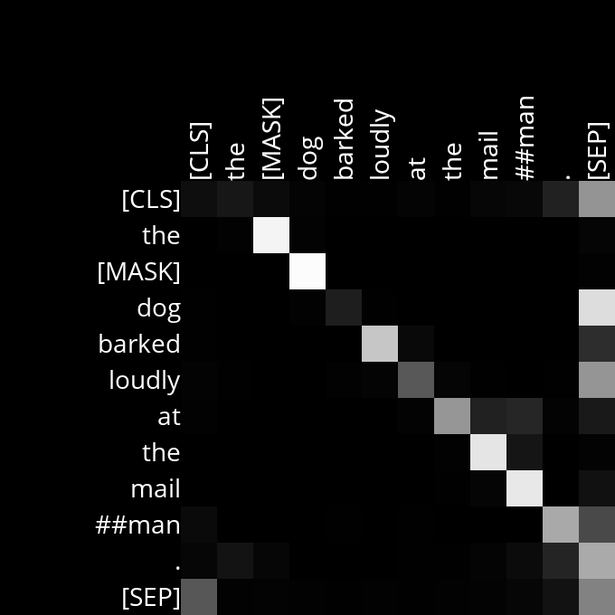

# Analysis
## Layer 6, Head 10

Example Sentences:
- Inputs:
    - The [MASK] cat slept on the mat.
    - The [MASK] dog barked loudly at the mailman.

- Outputs: 
    - The black cat slept on the mat.
    - The big cat slept on the mat.
    - The brown cat slept on the mat.
    - The big dog barked loudly at the mailman.
    - The little dog barked loudly at the mailman.
    - The black dog barked loudly at the mailman.

We can see from the image that there is high attention on 'the cat' when generating the adjective word. It also pays high attention to the cat being on 'the mat' to ensure that the adjective has context. While in the dog version, there is high attention to what the dog is barking at. It seems it checks for future context before deciding which adjective to use.
